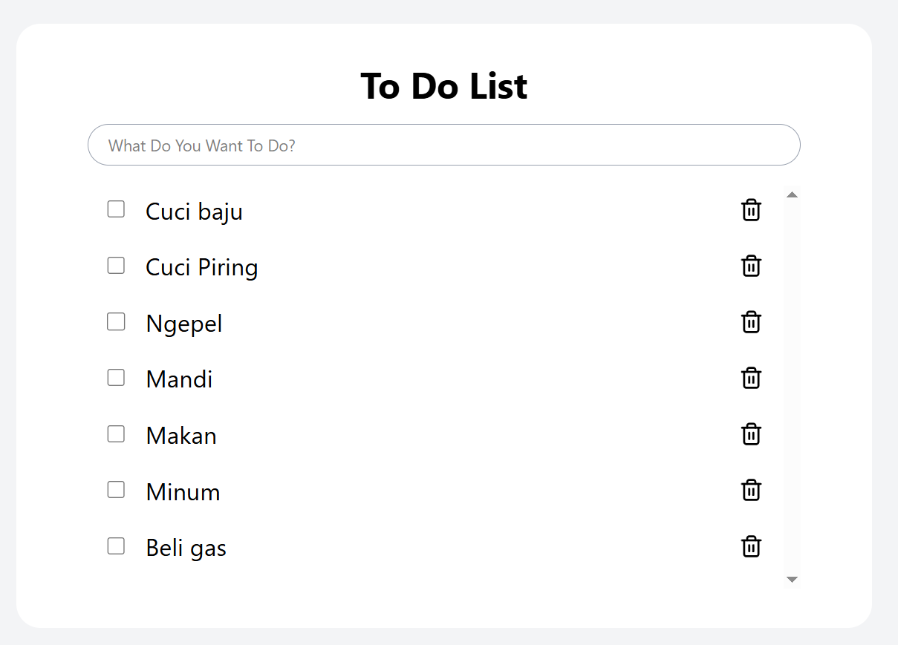

# Basic React Project Form

This project is for training only. Through this project, we learn to create input form web pages and display the result from user's input with a table. This project implement React-Hook, React-Router-DOM and React-Hook-Form.

## Preview



## How to Run this Project

1. Clone this project
```
git clone https://github.com/mdavindarinaldy/fgo24-react-form.git
```
2. Install dependencies
```
npm install
``` 
3. Run the project
```
npm run dev
```
4. Project will running on http://localhost:5173

## Dependencies
This project using node.js to run, make sure to install node on your machine. Other than that, this project also using Vite, React, React Hook, React Hook Form, React Router DOM and ESLint.

## Basic Information
This project is part of training in Kodacademy Bootcamp Batch 24 made by Muhammad Davinda Rinaldy
